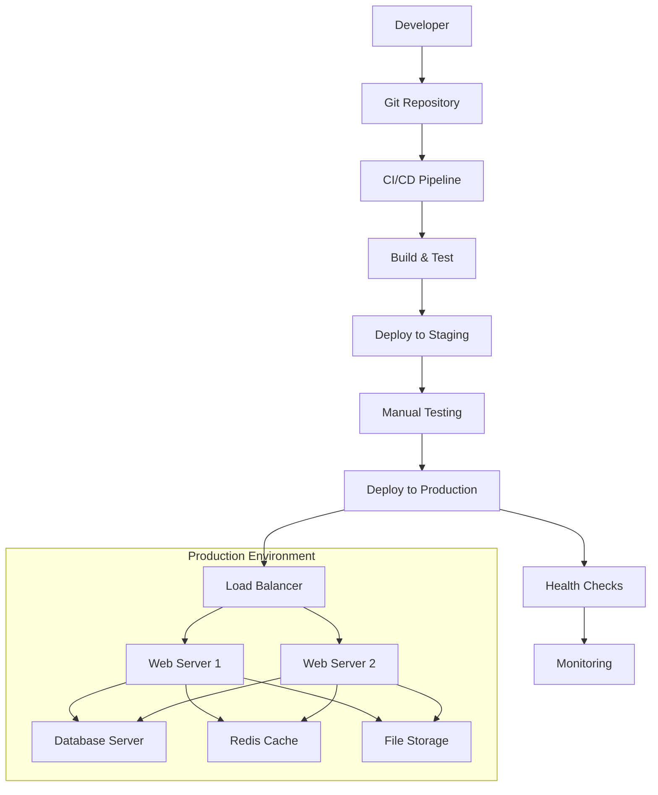

# Deployment and Maintenance Guidelines - People Of Data Platform

## 1. Deployment Overview

### 1.1 Deployment Architecture



### 1.2 Environment Configuration

**Environment Types**
- **Development**: Local development environment
- **Staging**: Pre-production testing environment
- **Production**: Live production environment

**Environment Variables**
```bash
# Application Configuration
APP_NAME="People Of Data"
APP_ENV=production
APP_KEY=base64:generated_key_here
APP_DEBUG=false
APP_URL=https://peopleofdata.com

# Database Configuration
DB_CONNECTION=mysql
DB_HOST=127.0.0.1
DB_PORT=3306
DB_DATABASE=people_of_data
DB_USERNAME=pod_user
DB_PASSWORD=secure_password

# Redis Configuration
REDIS_HOST=127.0.0.1
REDIS_PASSWORD=redis_password
REDIS_PORT=6379

# Mail Configuration
MAIL_MAILER=smtp
MAIL_HOST=smtp.gmail.com
MAIL_PORT=587
MAIL_USERNAME=noreply@peopleofdata.com
MAIL_PASSWORD=app_password
MAIL_ENCRYPTION=tls
MAIL_FROM_ADDRESS=noreply@peopleofdata.com
MAIL_FROM_NAME="People Of Data"

# OAuth Configuration
GOOGLE_CLIENT_ID=your_google_client_id
GOOGLE_CLIENT_SECRET=your_google_client_secret
GOOGLE_REDIRECT_URI=https://peopleofdata.com/auth/google/callback

LINKEDIN_CLIENT_ID=your_linkedin_client_id
LINKEDIN_CLIENT_SECRET=your_linkedin_client_secret
LINKEDIN_REDIRECT_URI=https://peopleofdata.com/auth/linkedin/callback

# OpenAI Configuration
OPENAI_API_KEY=your_openai_api_key
OPENAI_ORGANIZATION=your_openai_org_id

# File Storage Configuration
FILESYSTEM_DISK=public
AWS_ACCESS_KEY_ID=your_aws_access_key
AWS_SECRET_ACCESS_KEY=your_aws_secret_key
AWS_DEFAULT_REGION=us-east-1
AWS_BUCKET=pod-storage
AWS_USE_PATH_STYLE_ENDPOINT=false

# Queue Configuration
QUEUE_CONNECTION=redis

# Session Configuration
SESSION_DRIVER=redis
SESSION_LIFETIME=120

# Cache Configuration
CACHE_DRIVER=redis

# Analytics Configuration
GOOGLE_ANALYTICS_ID=GA_MEASUREMENT_ID
HOTJAR_ID=your_hotjar_id

# Security Configuration
SANCTUM_STATEFUL_DOMAINS=peopleofdata.com,www.peopleofdata.com
SESSION_DOMAIN=.peopleofdata.com
```

## 2. Server Requirements and Setup

### 2.1 Minimum Server Requirements

**Production Server Specifications**
- **CPU**: 4 cores (2.4 GHz or higher)
- **RAM**: 8 GB minimum, 16 GB recommended
- **Storage**: 100 GB SSD minimum
- **Bandwidth**: 1 Gbps connection
- **Operating System**: Ubuntu 22.04 LTS or CentOS 8+

**Software Requirements**
- **PHP**: 8.1 or higher
- **MySQL**: 8.0 or higher
- **Redis**: 6.0 or higher
- **Node.js**: 18.0 or higher
- **Nginx**: 1.20 or higher
- **Composer**: 2.0 or higher

### 2.2 Server Setup Script

**Ubuntu 22.04 Setup Script**
```bash
#!/bin/bash
# Server setup script for People Of Data platform

# Update system packages
sudo apt update && sudo apt upgrade -y

# Install required packages
sudo apt install -y software-properties-common curl wget git unzip

# Install PHP 8.1 and extensions
sudo add-apt-repository ppa:ondrej/php -y
sudo apt update
sudo apt install -y php8.1 php8.1-fpm php8.1-mysql php8.1-redis \
    php8.1-mbstring php8.1-xml php8.1-curl php8.1-zip php8.1-gd \
    php8.1-intl php8.1-bcmath php8.1-soap php8.1-imagick

# Install MySQL 8.0
sudo apt install -y mysql-server-8.0
sudo mysql_secure_installation

# Install Redis
sudo apt install -y redis-server
sudo systemctl enable redis-server
sudo systemctl start redis-server

# Install Nginx
sudo apt install -y nginx
sudo systemctl enable nginx
sudo systemctl start nginx

# Install Node.js 18
curl -fsSL https://deb.nodesource.com/setup_18.x | sudo -E bash -
sudo apt install -y nodejs

# Install Composer
curl -sS https://getcomposer.org/installer | php
sudo mv composer.phar /usr/local/bin/composer
sudo chmod +x /usr/local/bin/composer

# Install Supervisor for queue management
sudo apt install -y supervisor

# Configure firewall
sudo ufw allow 22
sudo ufw allow 80
sudo ufw allow 443
sudo ufw --force enable

echo "Server setup completed successfully!"
```

### 2.3 Nginx Configuration

**Main Nginx Configuration**
```nginx
# /etc/nginx/sites-available/peopleofdata.com
server {
    listen 80;
    listen [::]:80;
    server_name peopleofdata.com www.peopleofdata.com;
    return 301 https://$server_name$request_uri;
}

server {
    listen 443 ssl http2;
    listen [::]:443 ssl http2;
    server_name peopleofdata.com www.peopleofdata.com;
    root /var/www/peopleofdata/public;
    index index.php index.html;

    # SSL Configuration
    ssl_certificate /etc/letsencrypt/live/peopleofdata.com/fullchain.pem;
    ssl_certificate_key /etc/letsencrypt/live/peopleofdata.com/privkey.pem;
    ssl_protocols TLSv1.2 TLSv1.3;
    ssl_ciphers ECDHE-RSA-AES256-GCM-SHA512:DHE-RSA-AES256-GCM-SHA512:ECDHE-RSA-AES256-GCM-SHA384:DHE-RSA-AES256-GCM-SHA384;
    ssl_prefer_server_ciphers off;
    ssl_session_cache shared:SSL:10m;
    ssl_session_timeout 10m;

    # Security Headers
    add_header X-Frame-Options "SAMEORIGIN" always;
    add_header X-Content-Type-Options "nosniff" always;
    add_header X-XSS-Protection "1; mode=block" always;
    add_header Referrer-Policy "strict-origin-when-cross-origin" always;
    add_header Content-Security-Policy "default-src 'self'; script-src 'self' 'unsafe-inline' 'unsafe-eval' https://www.googletagmanager.com https://static.hotjar.com; style-src 'self' 'unsafe-inline' https://fonts.googleapis.com; font-src 'self' https://fonts.gstatic.com; img-src 'self' data: https:; connect-src 'self' https://api.openai.com;" always;

    # Gzip Compression
    gzip on;
    gzip_vary on;
    gzip_min_length 1024;
    gzip_proxied any;
    gzip_comp_level 6;
    gzip_types text/plain text/css text/xml text/javascript application/javascript application/xml+rss application/json;

    # Client Max Body Size
    client_max_body_size 50M;

    # Rate Limiting
    limit_req_zone $binary_remote_addr zone=login:10m rate=5r/m;
    limit_req_zone $binary_remote_addr zone=api:10m rate=60r/m;

    # Main Location Block
    location / {
        try_files $uri $uri/ /index.php?$query_string;
    }

    # PHP-FPM Configuration
    location ~ \.php$ {
        fastcgi_pass unix:/var/run/php/php8.1-fpm.sock;
        fastcgi_param SCRIPT_FILENAME $realpath_root$fastcgi_script_name;
        include fastcgi_params;
        fastcgi_hide_header X-Powered-By;
        fastcgi_read_timeout 300;
        fastcgi_buffer_size 128k;
        fastcgi_buffers 4 256k;
        fastcgi_busy_buffers_size 256k;
    }

    # API Rate Limiting
    location /api/ {
        limit_req zone=api burst=20 nodelay;
        try_files $uri $uri/ /index.php?$query_string;
    }

    # Login Rate Limiting
    location /login {
        limit_req zone=login burst=5 nodelay;
        try_files $uri $uri/ /index.php?$query_string;
    }

    # Static Assets Caching
    location ~* \.(jpg|jpeg|png|gif|ico|css|js|woff|woff2|ttf|svg)$ {
        expires 1y;
        add_header Cache-Control "public, immutable";
        access_log off;
    }

    # Security - Deny access to sensitive files
    location ~ /\. {
        deny all;
        access_log off;
        log_not_found off;
    }

    location ~ /\.env {
        deny all;
        access_log off;
        log_not_found off;
    }

    # Logs
    access_log /var/log/nginx/peopleofdata_access.log;
    error_log /var/log/nginx/peopleofdata_error.log;
}
```

### 2.4 PHP-FPM Configuration

**PHP-FPM Pool Configuration**
```ini
; /etc/php/8.1/fpm/pool.d/peopleofdata.conf
[peopleofdata]
user = www-data
group = www-data
listen = /var/run/php/php8.1-fpm.sock
listen.owner = www-data
listen.group = www-data
listen.mode = 0660

pm = dynamic
pm.max_children = 50
pm.start_servers = 10
pm.min_spare_servers = 5
pm.max_spare_servers = 20
pm.max_requests = 1000

; Performance tuning
request_terminate_timeout = 300
rlimit_files = 65536
rlimit_core = 0

; Environment variables
env[HOSTNAME] = $HOSTNAME
env[PATH] = /usr/local/bin:/usr/bin:/bin
env[TMP] = /tmp
env[TMPDIR] = /tmp
env[TEMP] = /tmp

; PHP configuration
php_admin_value[sendmail_path] = /usr/sbin/sendmail -t -i -f noreply@peopleofdata.com
php_flag[display_errors] = off
php_admin_value[error_log] = /var/log/php/peopleofdata_error.log
php_admin_flag[log_errors] = on
php_admin_value[memory_limit] = 512M
php_admin_value[max_execution_time] = 300
php_admin_value[upload_max_filesize] = 50M
php_admin_value[post_max_size] = 50M
```

## 3. Database Configuration

### 3.1 MySQL Configuration

**MySQL Configuration File**
```ini
# /etc/mysql/mysql.conf.d/mysqld.cnf
[mysqld]
# Basic Settings
user = mysql
pid-file = /var/run/mysqld/mysqld.pid
socket = /var/run/mysqld/mysqld.sock
port = 3306
basedir = /usr
datadir = /var/lib/mysql
tmpdir = /tmp
lc-messages-dir = /usr/share/mysql

# Character Set
character-set-server = utf8mb4
collation-server = utf8mb4_unicode_ci

# InnoDB Settings
default-storage-engine = InnoDB
innodb_buffer_pool_size = 4G
innodb_log_file_size = 512M
innodb_log_buffer_size = 64M
innodb_flush_log_at_trx_commit = 1
innodb_lock_wait_timeout = 120
innodb_file_per_table = 1

# Query Cache (disabled in MySQL 8.0)
# query_cache_type = 1
# query_cache_size = 256M

# Connection Settings
max_connections = 200
max_connect_errors = 10000
connect_timeout = 60
wait_timeout = 28800
interactive_timeout = 28800

# Buffer Settings
key_buffer_size = 256M
max_allowed_packet = 64M
table_open_cache = 4000
sort_buffer_size = 4M
read_buffer_size = 2M
read_rnd_buffer_size = 16M
myisam_sort_buffer_size = 128M
thread_cache_size = 50

# Binary Logging
log-bin = mysql-bin
binlog-format = ROW
expire_logs_days = 7
max_binlog_size = 100M
sync_binlog = 1

# Slow Query Log
slow_query_log = 1
slow_query_log_file = /var/log/mysql/slow.log
long_query_time = 2
log_queries_not_using_indexes = 1

# Error Log
log_error = /var/log/mysql/error.log

# Security
local-infile = 0
skip-show-database

[mysql]
default-character-set = utf8mb4

[client]
default-character-set = utf8mb4
```

### 3.2 Database User Setup

**Database User Creation**
```sql
-- Create application database
CREATE DATABASE people_of_data CHARACTER SET utf8mb4 COLLATE utf8mb4_unicode_ci;

-- Create application user
CREATE USER 'pod_user'@'localhost' IDENTIFIED BY 'secure_password';
GRANT ALL PRIVILEGES ON people_of_data.* TO 'pod_user'@'localhost';

-- Create backup user
CREATE USER 'backup_user'@'localhost' IDENTIFIED BY 'backup_password';
GRANT SELECT, LOCK TABLES, SHOW VIEW, EVENT, TRIGGER ON people_of_data.* TO 'backup_user'@'localhost';

-- Create monitoring user
CREATE USER 'monitor_user'@'localhost' IDENTIFIED BY 'monitor_password';
GRANT PROCESS, REPLICATION CLIENT ON *.* TO 'monitor_user'@'localhost';
GRANT SELECT ON performance_schema.* TO 'monitor_user'@'localhost';

FLUSH PRIVILEGES;
```

## 4. Deployment Process

### 4.1 Automated Deployment Script

**Deployment Script**
```bash
#!/bin/bash
# Automated deployment script for People Of Data platform

set -e  # Exit on any error

# Configuration
APP_DIR="/var/www/peopleofdata"
BACKUP_DIR="/var/backups/deployments"
GIT_REPO="https://github.com/your-org/people-of-data.git"
BRANCH="main"
DATE=$(date +"%Y%m%d_%H%M%S")

# Colors for output
RED='\033[0;31m'
GREEN='\033[0;32m'
YELLOW='\033[1;33m'
NC='\033[0m' # No Color

echo -e "${GREEN}Starting deployment at $(date)${NC}"

# Function to log messages
log() {
    echo -e "${GREEN}[$(date +'%Y-%m-%d %H:%M:%S')] $1${NC}"
}

error() {
    echo -e "${RED}[$(date +'%Y-%m-%d %H:%M:%S')] ERROR: $1${NC}"
    exit 1
}

warning() {
    echo -e "${YELLOW}[$(date +'%Y-%m-%d %H:%M:%S')] WARNING: $1${NC}"
}

# Pre-deployment checks
log "Running pre-deployment checks..."

# Check if application directory exists
if [ ! -d "$APP_DIR" ]; then
    error "Application directory $APP_DIR does not exist"
fi

# Check if .env file exists
if [ ! -f "$APP_DIR/.env" ]; then
    error ".env file not found in $APP_DIR"
fi

# Check database connectivity
log "Checking database connectivity..."
php $APP_DIR/artisan tinker --execute="DB::connection()->getPdo();" || error "Database connection failed"

# Create backup
log "Creating backup..."
mkdir -p $BACKUP_DIR
cp -r $APP_DIR $BACKUP_DIR/backup_$DATE
log "Backup created at $BACKUP_DIR/backup_$DATE"

# Enter maintenance mode
log "Entering maintenance mode..."
php $APP_DIR/artisan down --message="Deployment in progress" --retry=60

# Pull latest code
log "Pulling latest code from $BRANCH branch..."
cd $APP_DIR
git fetch origin
git reset --hard origin/$BRANCH

# Install/update dependencies
log "Installing Composer dependencies..."
composer install --no-dev --optimize-autoloader --no-interaction

log "Installing NPM dependencies..."
npm ci --production

# Build assets
log "Building frontend assets..."
npm run build

# Clear caches
log "Clearing application caches..."
php artisan config:clear
php artisan route:clear
php artisan view:clear
php artisan cache:clear

# Run database migrations
log "Running database migrations..."
php artisan migrate --force

# Optimize application
log "Optimizing application..."
php artisan config:cache
php artisan route:cache
php artisan view:cache
php artisan event:cache

# Set proper permissions
log "Setting file permissions..."
chown -R www-data:www-data $APP_DIR
chmod -R 755 $APP_DIR
chmod -R 775 $APP_DIR/storage
chmod -R 775 $APP_DIR/bootstrap/cache

# Restart services
log "Restarting services..."
sudo systemctl reload php8.1-fpm
sudo systemctl reload nginx
sudo supervisorctl restart all

# Exit maintenance mode
log "Exiting maintenance mode..."
php artisan up

# Run health checks
log "Running post-deployment health checks..."

# Check if application is responding
HTTP_STATUS=$(curl -s -o /dev/null -w "%{http_code}" https://peopleofdata.com)
if [ "$HTTP_STATUS" != "200" ]; then
    error "Application health check failed. HTTP status: $HTTP_STATUS"
fi

# Check database connectivity
php artisan tinker --execute="DB::connection()->getPdo();" || error "Post-deployment database check failed"

# Check queue workers
QUEUE_WORKERS=$(supervisorctl status | grep "laravel-worker" | grep "RUNNING" | wc -l)
if [ "$QUEUE_WORKERS" -lt 1 ]; then
    warning "No queue workers are running"
fi

log "Deployment completed successfully at $(date)"
log "Application is now live at https://peopleofdata.com"

# Send deployment notification (optional)
# curl -X POST -H 'Content-type: application/json' \
#     --data '{"text":"People Of Data deployment completed successfully"}' \
#     YOUR_SLACK_WEBHOOK_URL

echo -e "${GREEN}Deployment finished successfully!${NC}"
```

### 4.2 CI/CD Pipeline Configuration

**GitHub Actions Workflow**
```yaml
# .github/workflows/deploy.yml
name: Deploy to Production

on:
  push:
    branches: [ main ]
  workflow_dispatch:

jobs:
  test:
    runs-on: ubuntu-latest
    
    services:
      mysql:
        image: mysql:8.0
        env:
          MYSQL_ROOT_PASSWORD: password
          MYSQL_DATABASE: testing
        ports:
          - 3306:3306
        options: --health-cmd="mysqladmin ping" --health-interval=10s --health-timeout=5s --health-retries=3
      
      redis:
        image: redis:6.0
        ports:
          - 6379:6379
        options: --health-cmd="redis-cli ping" --health-interval=10s --health-timeout=5s --health-retries=3
    
    steps:
    - uses: actions/checkout@v3
    
    - name: Setup PHP
      uses: shivammathur/setup-php@v2
      with:
        php-version: '8.1'
        extensions: mbstring, xml, ctype, iconv, intl, pdo_mysql, dom, filter, gd, iconv, json, mbstring, redis
        coverage: none
    
    - name: Setup Node.js
      uses: actions/setup-node@v3
      with:
        node-version: '18'
        cache: 'npm'
    
    - name: Copy .env
      run: php -r "file_exists('.env') || copy('.env.testing', '.env');"
    
    - name: Install Composer Dependencies
      run: composer install --no-progress --prefer-dist --optimize-autoloader
    
    - name: Install NPM Dependencies
      run: npm ci
    
    - name: Build Assets
      run: npm run build
    
    - name: Generate Application Key
      run: php artisan key:generate
    
    - name: Directory Permissions
      run: chmod -R 777 storage bootstrap/cache
    
    - name: Run Database Migrations
      run: php artisan migrate --force
      env:
        DB_CONNECTION: mysql
        DB_HOST: 127.0.0.1
        DB_PORT: 3306
        DB_DATABASE: testing
        DB_USERNAME: root
        DB_PASSWORD: password
    
    - name: Run Tests
      run: php artisan test
      env:
        DB_CONNECTION: mysql
        DB_HOST: 127.0.0.1
        DB_PORT: 3306
        DB_DATABASE: testing
        DB_USERNAME: root
        DB_PASSWORD: password
        REDIS_HOST: 127.0.0.1
        REDIS_PORT: 6379
    
    - name: Run Code Quality Checks
      run: |
        ./vendor/bin/phpstan analyse --memory-limit=2G
        ./vendor/bin/php-cs-fixer fix --dry-run --diff
  
  deploy:
    needs: test
    runs-on: ubuntu-latest
    if: github.ref == 'refs/heads/main'
    
    steps:
    - name: Deploy to Production
      uses: appleboy/ssh-action@v0.1.5
      with:
        host: ${{ secrets.HOST }}
        username: ${{ secrets.USERNAME }}
        key: ${{ secrets.SSH_KEY }}
        script: |
          cd /var/www/peopleofdata
          sudo -u www-data ./deploy.sh
    
    - name: Notify Deployment
      if: always()
      uses: 8398a7/action-slack@v3
      with:
        status: ${{ job.status }}
        channel: '#deployments'
        webhook_url: ${{ secrets.SLACK_WEBHOOK }}
```

## 5. Queue Management

### 5.1 Supervisor Configuration

**Queue Worker Configuration**
```ini
; /etc/supervisor/conf.d/laravel-worker.conf
[program:laravel-worker]
process_name=%(program_name)s_%(process_num)02d
command=php /var/www/peopleofdata/artisan queue:work redis --sleep=3 --tries=3 --max-time=3600
autostart=true
autorestart=true
stopasgroup=true
killasgroup=true
user=www-data
numprocs=4
redirect_stderr=true
stdout_logfile=/var/log/supervisor/laravel-worker.log
stopwaitsecs=3600

[program:laravel-scheduler]
process_name=%(program_name)s
command=php /var/www/peopleofdata/artisan schedule:work
autostart=true
autorestart=true
stopasgroup=true
killasgroup=true
user=www-data
numprocs=1
redirect_stderr=true
stdout_logfile=/var/log/supervisor/laravel-scheduler.log

[program:laravel-horizon]
process_name=%(program_name)s
command=php /var/www/peopleofdata/artisan horizon
autostart=true
autorestart=true
stopasgroup=true
killasgroup=true
user=www-data
numprocs=1
redirect_stderr=true
stdout_logfile=/var/log/supervisor/laravel-horizon.log
stopwaitsecs=3600
```

### 5.2 Queue Monitoring Script

**Queue Health Check Script**
```bash
#!/bin/bash
# Queue monitoring script

APP_DIR="/var/www/peopleofdata"
LOG_FILE="/var/log/queue-monitor.log"
ALERT_EMAIL="admin@peopleofdata.com"

# Function to log messages
log() {
    echo "[$(date +'%Y-%m-%d %H:%M:%S')] $1" | tee -a $LOG_FILE
}

# Check queue size
QUEUE_SIZE=$(php $APP_DIR/artisan queue:size)
if [ "$QUEUE_SIZE" -gt 1000 ]; then
    log "WARNING: Queue size is high: $QUEUE_SIZE jobs"
    echo "Queue size is critically high: $QUEUE_SIZE jobs" | mail -s "Queue Alert - People Of Data" $ALERT_EMAIL
fi

# Check failed jobs
FAILED_JOBS=$(php $APP_DIR/artisan queue:failed --format=json | jq length)
if [ "$FAILED_JOBS" -gt 10 ]; then
    log "WARNING: High number of failed jobs: $FAILED_JOBS"
    echo "High number of failed jobs: $FAILED_JOBS" | mail -s "Failed Jobs Alert - People Of Data" $ALERT_EMAIL
fi

# Check if queue workers are running
WORKER_COUNT=$(supervisorctl status | grep "laravel-worker" | grep "RUNNING" | wc -l)
if [ "$WORKER_COUNT" -lt 2 ]; then
    log "ERROR: Insufficient queue workers running: $WORKER_COUNT"
    supervisorctl restart laravel-worker:*
    echo "Queue workers restarted due to insufficient workers" | mail -s "Queue Workers Alert - People Of Data" $ALERT_EMAIL
fi

log "Queue monitoring completed. Queue size: $QUEUE_SIZE, Failed jobs: $FAILED_JOBS, Workers: $WORKER_COUNT"
```

## 6. Monitoring and Logging

### 6.1 Application Monitoring

**Health Check Endpoint**
```php
// routes/web.php
Route::get('/health', function () {
    $checks = [
        'database' => false,
        'redis' => false,
        'storage' => false,
        'queue' => false,
    ];
    
    try {
        // Database check
        DB::connection()->getPdo();
        $checks['database'] = true;
    } catch (Exception $e) {
        Log::error('Health check - Database failed: ' . $e->getMessage());
    }
    
    try {
        // Redis check
        Redis::ping();
        $checks['redis'] = true;
    } catch (Exception $e) {
        Log::error('Health check - Redis failed: ' . $e->getMessage());
    }
    
    try {
        // Storage check
        Storage::disk('public')->put('health-check.txt', 'OK');
        Storage::disk('public')->delete('health-check.txt');
        $checks['storage'] = true;
    } catch (Exception $e) {
        Log::error('Health check - Storage failed: ' . $e->getMessage());
    }
    
    try {
        // Queue check (check if workers are processing)
        $queueSize = Queue::size();
        $checks['queue'] = $queueSize < 1000; // Alert if queue is too large
    } catch (Exception $e) {
        Log::error('Health check - Queue failed: ' . $e->getMessage());
    }
    
    $allHealthy = array_reduce($checks, function ($carry, $check) {
        return $carry && $check;
    }, true);
    
    return response()->json([
        'status' => $allHealthy ? 'healthy' : 'unhealthy',
        'timestamp' => now()->toISOString(),
        'checks' => $checks,
        'version' => config('app.version', '1.0.0'),
    ], $allHealthy ? 200 : 503);
});
```

**System Monitoring Script**
```bash
#!/bin/bash
# System monitoring script

LOG_FILE="/var/log/system-monitor.log"
ALERT_EMAIL="admin@peopleofdata.com"
APP_URL="https://peopleofdata.com"

# Function to log messages
log() {
    echo "[$(date +'%Y-%m-%d %H:%M:%S')] $1" | tee -a $LOG_FILE
}

# Check disk usage
DISK_USAGE=$(df / | awk 'NR==2 {print $5}' | sed 's/%//')
if [ "$DISK_USAGE" -gt 80 ]; then
    log "WARNING: Disk usage is high: ${DISK_USAGE}%"
    echo "Disk usage is critically high: ${DISK_USAGE}%" | mail -s "Disk Space Alert - People Of Data" $ALERT_EMAIL
fi

# Check memory usage
MEMORY_USAGE=$(free | awk 'NR==2{printf "%.0f", $3*100/$2}')
if [ "$MEMORY_USAGE" -gt 90 ]; then
    log "WARNING: Memory usage is high: ${MEMORY_USAGE}%"
    echo "Memory usage is critically high: ${MEMORY_USAGE}%" | mail -s "Memory Alert - People Of Data" $ALERT_EMAIL
fi

# Check CPU load
CPU_LOAD=$(uptime | awk -F'load average:' '{print $2}' | awk '{print $1}' | sed 's/,//')
CPU_LOAD_INT=$(echo "$CPU_LOAD * 100" | bc | cut -d. -f1)
if [ "$CPU_LOAD_INT" -gt 400 ]; then  # 4.0 load average
    log "WARNING: CPU load is high: $CPU_LOAD"
    echo "CPU load is critically high: $CPU_LOAD" | mail -s "CPU Load Alert - People Of Data" $ALERT_EMAIL
fi

# Check application health
HTTP_STATUS=$(curl -s -o /dev/null -w "%{http_code}" "$APP_URL/health")
if [ "$HTTP_STATUS" != "200" ]; then
    log "ERROR: Application health check failed. HTTP status: $HTTP_STATUS"
    echo "Application is not responding properly. HTTP status: $HTTP_STATUS" | mail -s "Application Down Alert - People Of Data" $ALERT_EMAIL
fi

# Check SSL certificate expiration
SSL_EXPIRY=$(echo | openssl s_client -servername peopleofdata.com -connect peopleofdata.com:443 2>/dev/null | openssl x509 -noout -dates | grep notAfter | cut -d= -f2)
SSL_EXPIRY_EPOCH=$(date -d "$SSL_EXPIRY" +%s)
CURRENT_EPOCH=$(date +%s)
DAYS_UNTIL_EXPIRY=$(( (SSL_EXPIRY_EPOCH - CURRENT_EPOCH) / 86400 ))

if [ "$DAYS_UNTIL_EXPIRY" -lt 30 ]; then
    log "WARNING: SSL certificate expires in $DAYS_UNTIL_EXPIRY days"
    echo "SSL certificate expires in $DAYS_UNTIL_EXPIRY days" | mail -s "SSL Certificate Expiry Alert - People Of Data" $ALERT_EMAIL
fi

log "System monitoring completed. Disk: ${DISK_USAGE}%, Memory: ${MEMORY_USAGE}%, CPU Load: $CPU_LOAD, App Status: $HTTP_STATUS, SSL Days: $DAYS_UNTIL_EXPIRY"
```

### 6.2 Log Management

**Logrotate Configuration**
```bash
# /etc/logrotate.d/peopleofdata
/var/www/peopleofdata/storage/logs/*.log {
    daily
    missingok
    rotate 30
    compress
    delaycompress
    notifempty
    create 0644 www-data www-data
    postrotate
        /bin/systemctl reload php8.1-fpm
    endscript
}

/var/log/nginx/peopleofdata_*.log {
    daily
    missingok
    rotate 30
    compress
    delaycompress
    notifempty
    create 0644 www-data adm
    postrotate
        /bin/systemctl reload nginx
    endscript
}

/var/log/supervisor/laravel-*.log {
    daily
    missingok
    rotate 30
    compress
    delaycompress
    notifempty
    create 0644 root root
    postrotate
        /usr/bin/supervisorctl reread
        /usr/bin/supervisorctl update
    endscript
}
```

## 7. Backup and Recovery

### 7.1 Automated Backup Script

**Complete Backup Script**
```bash
#!/bin/bash
# Comprehensive backup script for People Of Data platform

set -e

# Configuration
APP_DIR="/var/www/peopleofdata"
BACKUP_DIR="/var/backups/peopleofdata"
DB_NAME="people_of_data"
DB_USER="backup_user"
DB_PASS="backup_password"
S3_BUCKET="pod-backups"
RETENTION_DAYS=30
DATE=$(date +"%Y%m%d_%H%M%S")
BACKUP_NAME="pod_backup_$DATE"

# Create backup directory
mkdir -p $BACKUP_DIR/$BACKUP_NAME

echo "Starting backup at $(date)"

# Database backup
echo "Backing up database..."
mysqldump --user=$DB_USER --password=$DB_PASS \
    --single-transaction --routines --triggers \
    --add-drop-database --databases $DB_NAME \
    > $BACKUP_DIR/$BACKUP_NAME/database.sql

# Application files backup
echo "Backing up application files..."
tar -czf $BACKUP_DIR/$BACKUP_NAME/application.tar.gz \
    --exclude='storage/logs/*' \
    --exclude='storage/framework/cache/*' \
    --exclude='storage/framework/sessions/*' \
    --exclude='storage/framework/views/*' \
    --exclude='node_modules' \
    --exclude='.git' \
    -C $(dirname $APP_DIR) $(basename $APP_DIR)

# Storage files backup
echo "Backing up storage files..."
tar -czf $BACKUP_DIR/$BACKUP_NAME/storage.tar.gz \
    -C $APP_DIR/storage/app public

# Configuration backup
echo "Backing up configuration..."
cp $APP_DIR/.env $BACKUP_DIR/$BACKUP_NAME/
cp -r /etc/nginx/sites-available/peopleofdata.com $BACKUP_DIR/$BACKUP_NAME/nginx.conf
cp -r /etc/supervisor/conf.d/laravel-*.conf $BACKUP_DIR/$BACKUP_NAME/

# Create backup manifest
echo "Creating backup manifest..."
cat > $BACKUP_DIR/$BACKUP_NAME/manifest.txt << EOF
Backup Date: $(date)
Application Version: $(cd $APP_DIR && git rev-parse HEAD)
Database Size: $(du -sh $BACKUP_DIR/$BACKUP_NAME/database.sql | cut -f1)
Application Size: $(du -sh $BACKUP_DIR/$BACKUP_NAME/application.tar.gz | cut -f1)
Storage Size: $(du -sh $BACKUP_DIR/$BACKUP_NAME/storage.tar.gz | cut -f1)
Total Backup Size: $(du -sh $BACKUP_DIR/$BACKUP_NAME | cut -f1)
EOF

# Compress entire backup
echo "Compressing backup..."
tar -czf $BACKUP_DIR/$BACKUP_NAME.tar.gz -C $BACKUP_DIR $BACKUP_NAME
rm -rf $BACKUP_DIR/$BACKUP_NAME

# Upload to S3 (optional)
if command -v aws &> /dev/null; then
    echo "Uploading backup to S3..."
    aws s3 cp $BACKUP_DIR/$BACKUP_NAME.tar.gz s3://$S3_BUCKET/
fi

# Clean up old backups
echo "Cleaning up old backups..."
find $BACKUP_DIR -name "pod_backup_*.tar.gz" -mtime +$RETENTION_DAYS -delete

# Log backup completion
echo "$(date): Backup completed - $BACKUP_NAME.tar.gz" >> /var/log/backup.log
echo "Backup completed successfully at $(date)"
echo "Backup file: $BACKUP_DIR/$BACKUP_NAME.tar.gz"
echo "Backup size: $(du -sh $BACKUP_DIR/$BACKUP_NAME.tar.gz | cut -f1)"
```

### 7.2 Recovery Procedures

**Recovery Script**
```bash
#!/bin/bash
# Recovery script for People Of Data platform

set -e

# Configuration
APP_DIR="/var/www/peopleofdata"
BACKUP_DIR="/var/backups/peopleofdata"
DB_NAME="people_of_data"
DB_USER="root"
RECOVERY_DIR="/tmp/recovery"

# Check if backup file is provided
if [ -z "$1" ]; then
    echo "Usage: $0 <backup_file.tar.gz>"
    echo "Available backups:"
    ls -la $BACKUP_DIR/pod_backup_*.tar.gz
    exit 1
fi

BACKUP_FILE="$1"

if [ ! -f "$BACKUP_FILE" ]; then
    echo "Error: Backup file $BACKUP_FILE not found"
    exit 1
fi

echo "Starting recovery from $BACKUP_FILE at $(date)"

# Create recovery directory
mkdir -p $RECOVERY_DIR
cd $RECOVERY_DIR

# Extract backup
echo "Extracting backup..."
tar -xzf $BACKUP_FILE
BACKUP_NAME=$(basename $BACKUP_FILE .tar.gz)

# Enter maintenance mode
echo "Entering maintenance mode..."
php $APP_DIR/artisan down --message="System recovery in progress" --retry=300

# Stop services
echo "Stopping services..."
sudo systemctl stop nginx
sudo supervisorctl stop all

# Backup current state before recovery
echo "Creating pre-recovery backup..."
cp -r $APP_DIR $APP_DIR.pre-recovery.$(date +%Y%m%d_%H%M%S)

# Restore database
echo "Restoring database..."
mysql -u $DB_USER -p < $RECOVERY_DIR/$BACKUP_NAME/database.sql

# Restore application files
echo "Restoring application files..."
rm -rf $APP_DIR
tar -xzf $RECOVERY_DIR/$BACKUP_NAME/application.tar.gz -C $(dirname $APP_DIR)

# Restore storage files
echo "Restoring storage files..."
tar -xzf $RECOVERY_DIR/$BACKUP_NAME/storage.tar.gz -C $APP_DIR/storage/app/

# Restore configuration
echo "Restoring configuration..."
cp $RECOVERY_DIR/$BACKUP_NAME/.env $APP_DIR/
cp $RECOVERY_DIR/$BACKUP_NAME/nginx.conf /etc/nginx/sites-available/peopleofdata.com
cp $RECOVERY_DIR/$BACKUP_NAME/laravel-*.conf /etc/supervisor/conf.d/

# Set proper permissions
echo "Setting file permissions..."
chown -R www-data:www-data $APP_DIR
chmod -R 755 $APP_DIR
chmod -R 775 $APP_DIR/storage
chmod -R 775 $APP_DIR/bootstrap/cache

# Clear caches
echo "Clearing caches..."
php $APP_DIR/artisan config:clear
php $APP_DIR/artisan route:clear
php $APP_DIR/artisan view:clear
php $APP_DIR/artisan cache:clear

# Optimize application
echo "Optimizing application..."
php $APP_DIR/artisan config:cache
php $APP_DIR/artisan route:cache
php $APP_DIR/artisan view:cache

# Reload configurations
echo "Reloading configurations..."
sudo supervisorctl reread
sudo supervisorctl update
sudo nginx -t && sudo systemctl reload nginx

# Start services
echo "Starting services..."
sudo systemctl start nginx
sudo supervisorctl start all

# Exit maintenance mode
echo "Exiting maintenance mode..."
php $APP_DIR/artisan up

# Run health checks
echo "Running health checks..."
sleep 10
HTTP_STATUS=$(curl -s -o /dev/null -w "%{http_code}" https://peopleofdata.com/health)
if [ "$HTTP_STATUS" != "200" ]; then
    echo "WARNING: Health check failed. HTTP status: $HTTP_STATUS"
else
    echo "Health check passed. Application is responding normally."
fi

# Clean up
echo "Cleaning up..."
rm -rf $RECOVERY_DIR

echo "Recovery completed successfully at $(date)"
echo "Please verify that all functionality is working correctly."
```

## 8. Security Hardening

### 8.1 Server Security Configuration

**SSH Hardening**
```bash
# /etc/ssh/sshd_config
Port 2222
Protocol 2
PermitRootLogin no
PasswordAuthentication no
PubkeyAuthentication yes
AuthorizedKeysFile .ssh/authorized_keys
PermitEmptyPasswords no
ChallengeResponseAuthentication no
UsePAM yes
X11Forwarding no
PrintMotd no
AcceptEnv LANG LC_*
Subsystem sftp /usr/lib/openssh/sftp-server
AllowUsers deployer
MaxAuthTries 3
ClientAliveInterval 300
ClientAliveCountMax 2
```

**Firewall Configuration**
```bash
#!/bin/bash
# UFW firewall configuration

# Reset firewall
ufw --force reset

# Default policies
ufw default deny incoming
ufw default allow outgoing

# SSH (custom port)
ufw allow 2222/tcp

# HTTP and HTTPS
ufw allow 80/tcp
ufw allow 443/tcp

# MySQL (only from localhost)
ufw allow from 127.0.0.1 to any port 3306

# Redis (only from localhost)
ufw allow from 127.0.0.1 to any port 6379

# Rate limiting for SSH
ufw limit 2222/tcp

# Enable firewall
ufw --force enable

# Show status
ufw status verbose
```

### 8.2 Application Security

**Security Headers Configuration**
```php
// app/Http/Middleware/SecurityHeaders.php
<?php

namespace App\Http\Middleware;

use Closure;
use Illuminate\Http\Request;

class SecurityHeaders
{
    public function handle(Request $request, Closure $next)
    {
        $response = $next($request);
        
        // Security headers
        $response->headers->set('X-Content-Type-Options', 'nosniff');
        $response->headers->set('X-Frame-Options', 'SAMEORIGIN');
        $response->headers->set('X-XSS-Protection', '1; mode=block');
        $response->headers->set('Referrer-Policy', 'strict-origin-when-cross-origin');
        $response->headers->set('Permissions-Policy', 'geolocation=(), microphone=(), camera=()');
        
        // HSTS header for HTTPS
        if ($request->secure()) {
            $response->headers->set('Strict-Transport-Security', 'max-age=31536000; includeSubDomains; preload');
        }
        
        // CSP header
        $csp = "default-src 'self'; " .
               "script-src 'self' 'unsafe-inline' 'unsafe-eval' https://www.googletagmanager.com https://static.hotjar.com; " .
               "style-src 'self' 'unsafe-inline' https://fonts.googleapis.com; " .
               "font-src 'self' https://fonts.gstatic.com; " .
               "img-src 'self' data: https:; " .
               "connect-src 'self' https://api.openai.com; " .
               "frame-ancestors 'none'; " .
               "base-uri 'self'; " .
               "form-action 'self'";
        
        $response->headers->set('Content-Security-Policy', $csp);
        
        return $response;
    }
}
```

## 9. Performance Optimization

### 9.1 Redis Configuration

**Redis Configuration File**
```conf
# /etc/redis/redis.conf

# Network
bind 127.0.0.1
port 6379
tcp-backlog 511
timeout 0
tcp-keepalive 300

# General
daemonize yes
supervised systemd
pidfile /var/run/redis/redis-server.pid
loglevel notice
logfile /var/log/redis/redis-server.log
databases 16

# Security
requirepass your_redis_password

# Memory Management
maxmemory 2gb
maxmemory-policy allkeys-lru

# Persistence
save 900 1
save 300 10
save 60 10000
stop-writes-on-bgsave-error yes
rdbcompression yes
rdbchecksum yes
dbfilename dump.rdb
dir /var/lib/redis

# AOF
appendonly yes
appendfilename "appendonly.aof"
appendfsync everysec
no-appendfsync-on-rewrite no
auto-aof-rewrite-percentage 100
auto-aof-rewrite-min-size 64mb
aof-load-truncated yes
aof-use-rdb-preamble yes

# Slow Log
slowlog-log-slower-than 10000
slowlog-max-len 128

# Client Output Buffer Limits
client-output-buffer-limit normal 0 0 0
client-output-buffer-limit replica 256mb 64mb 60
client-output-buffer-limit pubsub 32mb 8mb 60
```

### 9.2 Performance Monitoring

**Performance Monitoring Script**
```bash
#!/bin/bash
# Performance monitoring script

APP_DIR="/var/www/peopleofdata"
LOG_FILE="/var/log/performance-monitor.log"
METRICS_FILE="/var/log/performance-metrics.json"

# Function to log metrics in JSON format
log_metrics() {
    local timestamp=$(date -u +"%Y-%m-%dT%H:%M:%SZ")
    local cpu_usage=$(top -bn1 | grep "Cpu(s)" | awk '{print $2}' | sed 's/%us,//')
    local memory_usage=$(free | awk 'NR==2{printf "%.2f", $3*100/$2}')
    local disk_usage=$(df / | awk 'NR==2 {print $5}' | sed 's/%//')
    local load_avg=$(uptime | awk -F'load average:' '{print $2}' | awk '{print $1}' | sed 's/,//')
    
    # Database metrics
    local db_connections=$(mysql -u monitor_user -pmonitor_password -e "SHOW STATUS LIKE 'Threads_connected';" | awk 'NR==2 {print $2}')
    local db_queries=$(mysql -u monitor_user -pmonitor_password -e "SHOW STATUS LIKE 'Queries';" | awk 'NR==2 {print $2}')
    
    # Redis metrics
    local redis_memory=$(redis-cli info memory | grep used_memory_human | cut -d: -f2 | tr -d '\r')
    local redis_connections=$(redis-cli info clients | grep connected_clients | cut -d: -f2 | tr -d '\r')
    
    # Application metrics
    local response_time=$(curl -s -o /dev/null -w "%{time_total}" https://peopleofdata.com/health)
    local queue_size=$(php $APP_DIR/artisan queue:size)
    
    # Create JSON metrics
    cat > $METRICS_FILE << EOF
{
    "timestamp": "$timestamp",
    "system": {
        "cpu_usage": $cpu_usage,
        "memory_usage": $memory_usage,
        "disk_usage": $disk_usage,
        "load_average": $load_avg
    },
    "database": {
        "connections": $db_connections,
        "queries": $db_queries
    },
    "redis": {
        "memory_usage": "$redis_memory",
        "connections": $redis_connections
    },
    "application": {
        "response_time": $response_time,
        "queue_size": $queue_size
    }
}
EOF
    
    echo "[$(date)] Metrics collected: CPU: ${cpu_usage}%, Memory: ${memory_usage}%, Response: ${response_time}s" >> $LOG_FILE
}

# Collect metrics
log_metrics

# Send metrics to monitoring service (optional)
# curl -X POST -H "Content-Type: application/json" -d @$METRICS_FILE https://your-monitoring-service.com/metrics
```

---

**Last Updated**: January 2025
**Version**: 1.0
**Maintained By**: DevOps Team