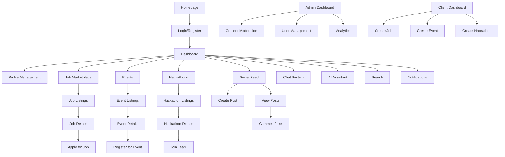

# Product Requirements Document - People Of Data Platform

## 1. Product Overview

People Of Data is a comprehensive community platform designed specifically for data science and AI professionals in Egypt and the MENA region. The platform serves as a central hub for career development, networking, knowledge sharing, and community engagement through job opportunities, events, hackathons, and social features.

The platform addresses the growing need for a specialized community where data professionals can connect, collaborate, and advance their careers while fostering innovation in the rapidly evolving field of artificial intelligence and data science.

Target market value: Capturing the expanding data science job market in MENA region, estimated to grow by 25% annually, with potential to become the leading platform for data professionals in the region.

## 2. Core Features

### 2.1 User Roles

| Role | Registration Method | Core Permissions |
|------|---------------------|------------------|
| Regular User | Email registration or OAuth (Google/LinkedIn) | Browse content, apply for jobs/events, participate in hackathons, create posts, use chat and AI assistant |
| Client User | User upgrade via admin-approved conversion request | All regular user permissions + create events, post jobs, create hackathons, enhanced business tools |
| Administrator | Manual assignment by Super Admin | Moderate content, manage applications, oversee events and hackathons, user management (limited scope) |
| Super Administrator | System-level assignment | Full platform control, user role management, system configuration, analytics access |

### 2.2 Feature Module

Our platform requirements consist of the following main pages:

1. **Homepage**: Hero section with dynamic counters, platform features showcase, call-to-action sections
2. **Authentication Pages**: Login, registration, password reset, email verification, OAuth integration
3. **User Dashboard**: Personalized content feed, quick actions, notifications, activity summary
4. **Profile Management**: Profile completion wizard, personal information, professional details, social links
5. **Job Marketplace**: Job listings with advanced filters, job posting creation, application management
6. **Events System**: Event discovery, event creation, registration management, ticket generation
7. **Hackathons Platform**: Hackathon listings, team formation, project submission, winner announcements
8. **Social Feed**: Post creation (text/image/URL/poll), commenting system, hashtag support, content engagement
9. **Chat System**: Real-time messaging, file sharing, conversation management
10. **AI Assistant**: Conversational AI interface, career guidance, platform help
11. **Search & Discovery**: Global search, advanced filters, user discovery, content exploration
12. **Notifications Center**: In-app notifications, email preferences, notification history
13. **Admin Dashboard**: Content moderation, user management, analytics, system settings
14. **Client Dashboard**: Business-specific tools, application management, event analytics

### 2.3 Page Details

| Page Name | Module Name | Feature Description |
|-----------|-------------|---------------------|
| Homepage | Hero Section | Display platform statistics with animated counters, showcase main value propositions, prominent call-to-action buttons |
| Homepage | Features Showcase | Highlight core platform features with icons and descriptions, responsive card layout |
| Homepage | Navigation Bar | Fixed responsive navigation with user authentication status, mobile hamburger menu |
| Authentication | Login Form | Email/password authentication, OAuth integration (Google/LinkedIn), remember me option, password reset link |
| Authentication | Registration Form | Multi-step registration with validation, email verification flow, OAuth registration |
| Authentication | Password Reset | Secure password reset via email token, new password confirmation |
| User Dashboard | Activity Feed | Personalized content stream, recent activities, recommended content based on user interests |
| User Dashboard | Quick Actions | Shortcuts to frequently used features, application status overview, upcoming events |
| User Dashboard | Statistics Widget | Personal metrics display, profile completion progress, engagement statistics |
| Profile Management | Personal Information | Name, email, phone, location, gender, bio editing with real-time validation |
| Profile Management | Professional Details | Skills tags, experience level, education background, portfolio links management |
| Profile Management | Social Links | LinkedIn, GitHub, Twitter, personal website URL management |
| Profile Management | Avatar Upload | Image upload with cropping, compression, format validation |
| Job Marketplace | Job Listings | Paginated job display with category filters, location filters, experience level filters, search functionality |
| Job Marketplace | Job Details | Comprehensive job information, company details, application requirements, related jobs |
| Job Marketplace | Job Application | Application form with cover letter, expected salary, availability date, additional information |
| Job Marketplace | Job Creation | Multi-step job posting form with rich text editor, skill requirements, deadline setting |
| Job Marketplace | Application Management | Track application status, view applicant details, update application status |
| Events System | Event Listings | Grid/list view of events with filters by type, date, location, search functionality |
| Events System | Event Details | Event information, agenda, registration status, attendee count, location/online link |
| Events System | Event Registration | One-click registration with email verification requirement, waitlist management |
| Events System | Event Creation | Event setup form with date/time picker, location/online options, capacity management |
| Events System | Ticket Management | Digital ticket generation with QR codes, check-in system for admins |
| Hackathons Platform | Hackathon Listings | Display active and upcoming hackathons with registration status, team formation progress |
| Hackathons Platform | Hackathon Details | Rules, prizes, timeline, team requirements, submission guidelines |
| Hackathons Platform | Team Formation | Create/join teams, invite users, team member management, role assignment |
| Hackathons Platform | Project Submission | File upload system, project description, technology stack, demo links |
| Social Feed | Post Creation | Rich text editor with image upload, URL link preview, poll creation (up to 20 options) |
| Social Feed | Content Display | Infinite scroll feed with post types (text/image/URL/poll), engagement metrics |
| Social Feed | Interaction System | Like/unlike posts, comment threading, share functionality, hashtag linking |
| Social Feed | Hashtag System | Auto-complete hashtag suggestions, hashtag pages, trending hashtags |
| Chat System | Conversation List | Display all conversations with last message preview, unread indicators, search conversations |
| Chat System | Message Interface | Real-time messaging with typing indicators, message status, emoji support |
| Chat System | File Sharing | Upload and share files with preview, file type validation, size limits |
| AI Assistant | Chat Interface | Conversational AI with context awareness, message history, conversation management |
| AI Assistant | Suggestions | AI-powered career advice, platform guidance, technical support |
| Search & Discovery | Global Search | Search across users, jobs, events, posts, hackathons with auto-complete |
| Search & Discovery | Advanced Filters | Multi-criteria filtering with date ranges, categories, locations, skills |
| Search & Discovery | Results Display | Categorized search results with relevance ranking, pagination |
| Notifications Center | Notification List | Categorized notifications with read/unread status, bulk actions |
| Notifications Center | Preferences | Granular notification settings for email and in-app notifications |
| Admin Dashboard | Content Moderation | Review and moderate posts, comments, user reports with action buttons |
| Admin Dashboard | User Management | User list with role management, account status control, profile verification |
| Admin Dashboard | Analytics | Platform usage statistics, user engagement metrics, content performance |
| Admin Dashboard | System Settings | Platform configuration, feature toggles, system maintenance tools |
| Client Dashboard | Business Tools | Enhanced analytics for posted jobs/events, applicant management, performance metrics |
| Client Dashboard | Conversion Request | Form to request client status upgrade with company information validation |

## 3. Core Process

### Regular User Flow
1. **Registration/Login**: User registers via email or OAuth → Email verification (optional but encouraged) → Profile completion wizard
2. **Content Consumption**: Browse jobs, events, hackathons, and social posts → Use search and filters → Engage with content
3. **Job Application**: Find relevant job → View details → Submit application (requires email verification) → Track application status
4. **Event Participation**: Discover events → Register for event (requires email verification) → Receive digital ticket → Attend event
5. **Social Engagement**: Create posts → Engage with community content → Use hashtags → Participate in discussions
6. **Networking**: Use chat system → Connect with other professionals → Join hackathon teams → Build professional network

### Client User Flow
1. **Conversion Request**: Submit client conversion request with company details → Admin review and approval → Access enhanced features
2. **Job Posting**: Create job posting → Set requirements and deadlines → Manage applications → Update application status
3. **Event Management**: Create events → Set capacity and registration rules → Manage attendees → Generate reports
4. **Hackathon Organization**: Create hackathons → Define rules and prizes → Monitor team formation → Select winners

### Admin Flow
1. **Content Moderation**: Review reported content → Take moderation actions → Manage user reports → Maintain community standards
2. **User Management**: Review client conversion requests → Manage user roles → Handle account issues → Monitor user activity
3. **Platform Oversight**: Monitor platform analytics → Configure system settings → Manage categories and tags → Ensure platform health

## 4. User Interface Design

### 4.1 Design Style

**Color Palette:**
- Primary: #3B82F6 (Blue-500) - Professional and trustworthy
- Secondary: #10B981 (Emerald-500) - Success and growth
- Accent: #F59E0B (Amber-500) - Attention and energy
- Neutral: #6B7280 (Gray-500) - Text and subtle elements
- Background: #F9FAFB (Gray-50) - Clean and modern
- Dark Mode: #1F2937 (Gray-800) - Professional dark theme

**Typography:**
- Primary Font: Inter (Google Fonts) - Modern and readable
- Headings: Font weights 600-700, sizes 24px-48px
- Body Text: Font weight 400, size 16px, line height 1.6
- Small Text: Font weight 400, size 14px for captions and metadata

**Button Styles:**
- Primary: Rounded corners (8px), solid background, hover effects
- Secondary: Outlined style with hover fill transition
- Icon Buttons: Circular or square with subtle hover effects
- Disabled State: Reduced opacity with cursor not-allowed

**Layout Style:**
- Card-based design with subtle shadows and rounded corners
- Top navigation with sidebar for authenticated users
- Responsive grid system using Tailwind CSS
- Consistent spacing using 8px grid system
- Mobile-first responsive design approach

**Icons and Visual Elements:**
- Heroicons for consistent iconography
- Subtle animations and transitions (300ms duration)
- Loading states with skeleton screens
- Empty states with helpful illustrations
- Success/error states with appropriate colors and icons

### 4.2 Page Design Overview

| Page Name | Module Name | UI Elements |
|-----------|-------------|-------------|
| Homepage | Hero Section | Full-width background with gradient overlay, centered content, animated counters, prominent CTA buttons with hover effects |
| Homepage | Features Grid | 3-column responsive grid (1 column on mobile), feature cards with icons, titles, descriptions, subtle hover animations |
| Homepage | Navigation | Fixed header with logo, navigation links, user avatar/login button, mobile hamburger menu with slide-out drawer |
| Dashboard | Sidebar | Collapsible sidebar with navigation icons, user profile summary, active state indicators, smooth transitions |
| Dashboard | Main Content | Grid layout with widgets, activity feed, quick action cards, responsive breakpoints |
| Dashboard | Activity Feed | Card-based posts with user avatars, timestamps, engagement buttons, infinite scroll loading |
| Profile | Form Layout | Multi-step wizard with progress indicator, form sections with clear labels, real-time validation feedback |
| Profile | Image Upload | Drag-and-drop area with preview, crop functionality, progress indicator, error handling |
| Job Marketplace | Filters Sidebar | Collapsible filter panel with checkboxes, range sliders, search inputs, clear filters button |
| Job Marketplace | Job Cards | Grid layout with company logos, job titles, location, salary range, application deadline, save job functionality |
| Job Details | Content Layout | Two-column layout with job details and application panel, responsive stacking on mobile |
| Events | Event Cards | Calendar-style layout with event banners, date/time prominently displayed, registration status badges |
| Events | Registration Modal | Overlay modal with event summary, terms acceptance, registration confirmation |
| Hackathons | Team Formation | Interactive team builder with drag-and-drop, member avatars, role assignments, invitation system |
| Social Feed | Post Composer | Expandable text area with formatting toolbar, image upload preview, poll option builder |
| Social Feed | Post Display | Card layout with user info, content, engagement metrics, comment threading |
| Chat | Conversation List | List with user avatars, last message preview, unread badges, search functionality |
| Chat | Message Interface | Chat bubble design with timestamps, message status indicators, typing indicators |
| AI Assistant | Chat Interface | Conversational UI with AI avatar, message bubbles, suggested responses, conversation history |
| Search | Results Layout | Tabbed interface for different content types, grid/list view toggle, sorting options |
| Notifications | List Layout | Grouped notifications by type, read/unread states, action buttons, bulk operations |
| Admin Dashboard | Data Tables | Sortable tables with pagination, bulk actions, inline editing, export functionality |
| Admin Dashboard | Analytics Charts | Interactive charts and graphs, date range selectors, metric cards, trend indicators |

### 4.3 Responsiveness

**Design Approach:** Mobile-first responsive design ensuring optimal experience across all devices

**Breakpoints:**
- Mobile: 320px - 768px (single column layout, stacked navigation)
- Tablet: 768px - 1024px (two-column layout, collapsible sidebar)
- Desktop: 1024px+ (multi-column layout, persistent sidebar)

**Touch Optimization:**
- Minimum touch target size of 44px for interactive elements
- Swipe gestures for mobile navigation and content browsing
- Touch-friendly form inputs with appropriate keyboard types
- Optimized spacing for thumb navigation

**Performance Considerations:**
- Lazy loading for images and content
- Progressive image loading with blur-up effect
- Optimized font loading with font-display: swap
- Minimal JavaScript bundle size for fast initial load

**Progressive Web App Features:**
- Service worker for offline functionality
- App manifest for home screen installation
- Push notifications for important updates
- Offline content caching for core features

---

**Last Updated**: January 2025
**Version**: 1.0
**Maintained By**: Product Team