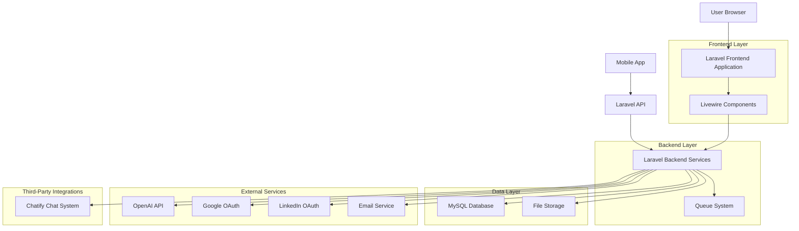
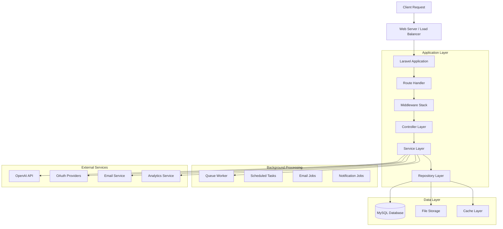
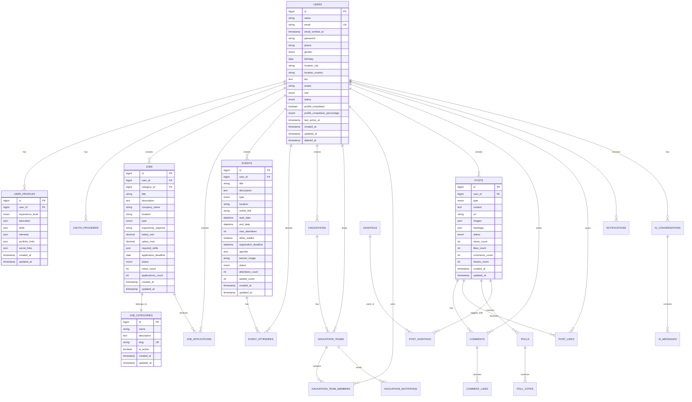

# Technical Architecture Document - People Of Data Platform

## 1. Architecture Design



## 2. Technology Description

### Frontend Stack

* **Framework**: Laravel Blade Templates with Livewire 3.x

* **JavaScript**: Alpine.js 3.x for interactive components

* **CSS Framework**: Tailwind CSS for responsive design

* **Icons**: Heroicons for consistent iconography

* **Build Tool**: Vite for asset compilation

* **Image Processing**: Intervention Image for upload handling

### Backend Stack

* **Framework**: Laravel (Latest LTS) with PHP 8.1+

* **Authentication**: Laravel Sanctum + OAuth 2.0 (Google, LinkedIn)

* **Database**: MySQL 8.0+ with Eloquent ORM

* **Queue System**: Laravel Queues with Database driver

* **File Storage**: Laravel File Storage (local/cloud)

* **Email**: Laravel Mail with SMTP

* **Chat**: Chatify package with API support

### External Services

* **AI Assistant**: OpenAI GPT-4 API

* **OAuth Providers**: Google OAuth 2.0, LinkedIn OAuth 2.0

* **Analytics**: Google Analytics + Custom tracking

* **UX Tools**: Hotjar for user behavior analysis

* **Email Service**: SMTP (Hostinger)

### Development Tools

* **Dependency Management**: Composer (PHP), NPM (JavaScript)

* **Testing**: PHPUnit for backend, Laravel Dusk for browser testing

* **Code Quality**: PHP CS Fixer, PHPStan for static analysis

* **Version Control**: Git with GitFlow workflow

* **CI/CD**: Automated testing and deployment pipelines

## 3. Route Definitions

| Route                   | Purpose                                  | Authentication | Role Required    |
| ----------------------- | ---------------------------------------- | -------------- | ---------------- |
| `/`                     | Homepage with platform overview          | No             | None             |
| `/login`                | User authentication page                 | No             | None             |
| `/register`             | User registration page                   | No             | None             |
| `/dashboard`            | User dashboard with personalized content | Yes            | User+            |
| `/profile`              | User profile management                  | Yes            | User+            |
| `/profile/complete`     | Profile completion wizard                | Yes            | User+            |
| `/jobs`                 | Job listings with search and filters     | No             | None             |
| `/jobs/create`          | Create new job posting                   | Yes            | Client+          |
| `/jobs/{id}`            | Individual job details and application   | No             | None             |
| `/jobs/{id}/apply`      | Job application form                     | Yes            | User+ (Verified) |
| `/events`               | Event listings and search                | No             | None             |
| `/events/create`        | Create new event                         | Yes            | Client+          |
| `/events/{id}`          | Event details and registration           | No             | None             |
| `/events/{id}/register` | Event registration                       | Yes            | User+ (Verified) |
| `/hackathons`           | Hackathon listings                       | No             | None             |
| `/hackathons/create`    | Create new hackathon                     | Yes            | Client+          |
| `/hackathons/{id}`      | Hackathon details and team management    | No             | None             |
| `/hackathons/{id}/join` | Join hackathon team                      | Yes            | User+ (Verified) |
| `/posts`                | Social posts feed                        | No             | None             |
| `/posts/create`         | Create new post                          | Yes            | User+            |
| `/posts/{id}`           | Individual post with comments            | No             | None             |
| `/search`               | Global search functionality              | No             | None             |
| `/chat`                 | Chat system interface                    | Yes            | User+            |
| `/ai-assistant`         | AI assistant chat interface              | Yes            | User+            |
| `/internships/apply`    | Internship application form              | Yes            | User+ (Verified) |
| `/notifications`        | User notifications center                | Yes            | User+            |
| `/admin`                | Admin dashboard                          | Yes            | Admin+           |
| `/admin/users`          | User management                          | Yes            | Admin+           |
| `/admin/content`        | Content moderation                       | Yes            | Admin+           |
| `/admin/analytics`      | Platform analytics                       | Yes            | Admin+           |
| `/client/request`       | Client conversion request                | Yes            | User             |
| `/client/dashboard`     | Client-specific dashboard                | Yes            | Client+          |

## 4. API Definitions

### 4.1 Authentication APIs

#### User Login

```
POST /api/auth/login
```

**Request:**

| Param Name | Param Type | Required | Description            |
| ---------- | ---------- | -------- | ---------------------- |
| email      | string     | true     | User email address     |
| password   | string     | true     | User password          |
| remember   | boolean    | false    | Remember login session |

**Response:**

| Param Name  | Param Type | Description              |
| ----------- | ---------- | ------------------------ |
| success     | boolean    | Login success status     |
| token       | string     | API authentication token |
| user        | object     | User profile data        |
| expires\_at | datetime   | Token expiration time    |

**Example Request:**

```json
{
  "email": "user@example.com",
  "password": "password123",
  "remember": true
}
```

**Example Response:**

```json
{
  "success": true,
  "token": "1|abc123def456...",
  "user": {
    "id": 1,
    "name": "John Doe",
    "email": "user@example.com",
    "role": "user"
  },
  "expires_at": "2025-02-01T00:00:00Z"
}
```

#### User Registration

```
POST /api/auth/register
```

**Request:**

| Param Name             | Param Type | Required | Description                |
| ---------------------- | ---------- | -------- | -------------------------- |
| name                   | string     | true     | Full name                  |
| email                  | string     | true     | Email address              |
| password               | string     | true     | Password (min 8 chars)     |
| password\_confirmation | string     | true     | Password confirmation      |
| phone                  | string     | false    | Phone number               |
| gender                 | string     | false    | Gender (male/female/other) |

### 4.2 Job Management APIs

#### Get Job Listings

```
GET /api/jobs
```

**Query Parameters:**

| Param Name   | Param Type | Required | Description             |
| ------------ | ---------- | -------- | ----------------------- |
| category\_id | integer    | false    | Filter by job category  |
| type         | string     | false    | Job type filter         |
| location     | string     | false    | Location filter         |
| search       | string     | false    | Search query            |
| page         | integer    | false    | Pagination page         |
| per\_page    | integer    | false    | Items per page (max 50) |

#### Create Job Posting

```
POST /api/jobs
```

**Request:**

| Param Name            | Param Type | Required | Description                                             |
| --------------------- | ---------- | -------- | ------------------------------------------------------- |
| title                 | string     | true     | Job title                                               |
| description           | text       | true     | Job description                                         |
| company\_name         | string     | true     | Company name                                            |
| category\_id          | integer    | true     | Job category ID                                         |
| location              | string     | true     | Job location                                            |
| type                  | string     | true     | Job type (full\_time/part\_time/contract/remote/hybrid) |
| required\_skills      | array      | true     | Required skills array                                   |
| salary\_min           | decimal    | false    | Minimum salary                                          |
| salary\_max           | decimal    | false    | Maximum salary                                          |
| application\_deadline | date       | false    | Application deadline                                    |

### 4.3 Event Management APIs

#### Get Events

```
GET /api/events
```

#### Register for Event

```
POST /api/events/{id}/register
```

### 4.4 Chat APIs

#### Get Conversations

```
GET /api/chat/conversations
```

#### Send Message

```
POST /api/chat/conversations/{id}/messages
```

### 4.5 AI Assistant APIs

#### Chat with AI

```
POST /api/ai/chat
```

**Request:**

| Param Name       | Param Type | Required | Description              |
| ---------------- | ---------- | -------- | ------------------------ |
| message          | string     | true     | User message to AI       |
| conversation\_id | integer    | false    | Existing conversation ID |

## 5. Server Architecture Diagram



## 6. Data Model

### 6.1 Data Model Definition



### 6.2 Data Definition Language

#### Users Table

```sql
-- Create users table
CREATE TABLE users (
    id BIGINT UNSIGNED AUTO_INCREMENT PRIMARY KEY,
    name VARCHAR(255) NOT NULL,
    email VARCHAR(255) UNIQUE NOT NULL,
    email_verified_at TIMESTAMP NULL,
    password VARCHAR(255) NOT NULL,
    phone VARCHAR(20) NULL,
    gender ENUM('male', 'female', 'other') NULL,
    birthday DATE NULL,
    location_city VARCHAR(100) NULL,
    location_country VARCHAR(100) NULL,
    bio TEXT NULL,
    avatar VARCHAR(255) NULL,
    role ENUM('superadmin', 'admin', 'client', 'user') DEFAULT 'user',
    status ENUM('active', 'inactive', 'suspended') DEFAULT 'active',
    profile_completed BOOLEAN DEFAULT FALSE,
    profile_completion_percentage TINYINT DEFAULT 0,
    last_active_at TIMESTAMP NULL,
    created_at TIMESTAMP DEFAULT CURRENT_TIMESTAMP,
    updated_at TIMESTAMP DEFAULT CURRENT_TIMESTAMP ON UPDATE CURRENT_TIMESTAMP,
    deleted_at TIMESTAMP NULL
);

-- Create indexes
CREATE INDEX idx_users_email ON users(email);
CREATE INDEX idx_users_role ON users(role);
CREATE INDEX idx_users_status ON users(status);
CREATE INDEX idx_users_deleted_at ON users(deleted_at);
```

#### Jobs Table

```sql
-- Create jobs table
CREATE TABLE jobs (
    id BIGINT UNSIGNED AUTO_INCREMENT PRIMARY KEY,
    user_id BIGINT UNSIGNED NOT NULL,
    category_id BIGINT UNSIGNED NOT NULL,
    title VARCHAR(255) NOT NULL,
    description TEXT NOT NULL,
    company_name VARCHAR(255) NOT NULL,
    location VARCHAR(255) NOT NULL,
    type ENUM('full_time', 'part_time', 'contract', 'remote', 'hybrid') NOT NULL,
    experience_required VARCHAR(100) NULL,
    salary_min DECIMAL(10,2) NULL,
    salary_max DECIMAL(10,2) NULL,
    required_skills JSON NOT NULL,
    application_deadline DATE NULL,
    status ENUM('active', 'archived', 'closed') DEFAULT 'active',
    views_count INT DEFAULT 0,
    applications_count INT DEFAULT 0,
    created_at TIMESTAMP DEFAULT CURRENT_TIMESTAMP,
    updated_at TIMESTAMP DEFAULT CURRENT_TIMESTAMP ON UPDATE CURRENT_TIMESTAMP,
    FOREIGN KEY (user_id) REFERENCES users(id) ON DELETE CASCADE,
    FOREIGN KEY (category_id) REFERENCES job_categories(id) ON DELETE RESTRICT
);

-- Create indexes
CREATE INDEX idx_jobs_category_status ON jobs(category_id, status);
CREATE INDEX idx_jobs_user_id ON jobs(user_id);
CREATE INDEX idx_jobs_deadline ON jobs(application_deadline);
CREATE INDEX idx_jobs_created_at ON jobs(created_at DESC);
```

#### Events Table

```sql
--
```

